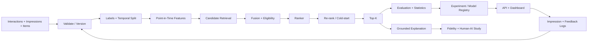
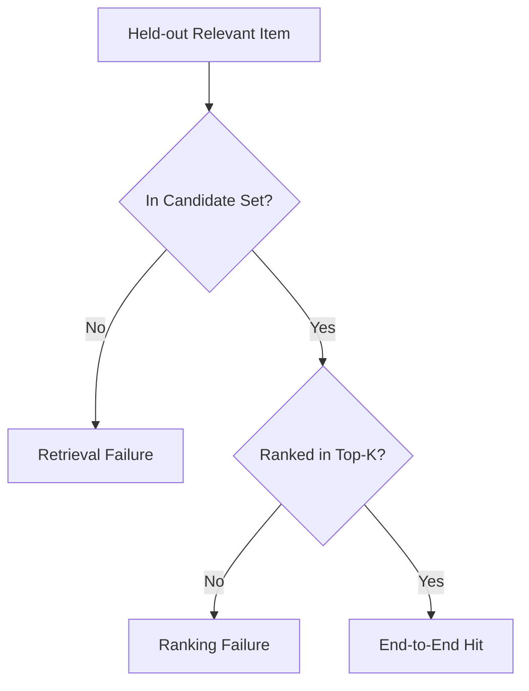
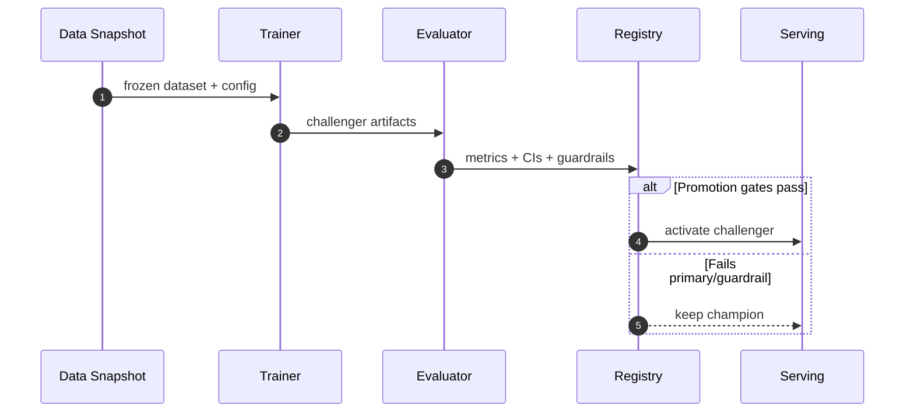
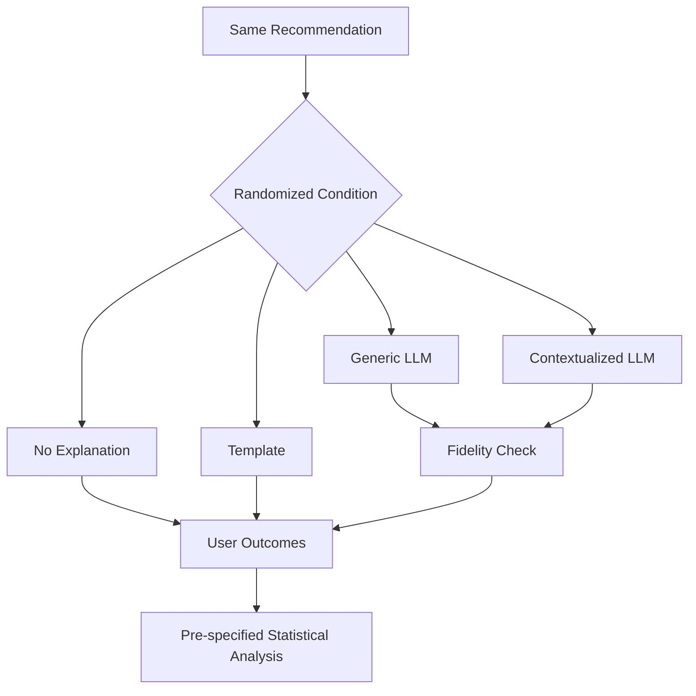

# RecomLab Diagrams

## 1. End-to-End Architecture

```mermaid
flowchart LR
  RAW[Interactions + Impressions + Items] --> DATA[Validate / Version]
  DATA --> SPLIT[Labels + Temporal Split]
  SPLIT --> FEAT[Point-in-Time Features]
  FEAT --> RET[Candidate Retrieval]
  RET --> FUSE[Fusion + Eligibility]
  FUSE --> RANK[Ranker]
  RANK --> RERANK[Re-rank / Cold-start]
  RERANK --> TOPK[Top-K]
  TOPK --> EVAL[Evaluation + Statistics]
  EVAL --> REG[Experiment / Model Registry]
  REG --> SERVE[API + Dashboard]
  SERVE --> LOG[Impression + Feedback Logs]
  LOG --> DATA
  TOPK --> EX[Grounded Explanation]
  EX --> STUDY[Fidelity + Human-AI Study]
```

## 2. Candidate vs Ranking Evaluation

```mermaid
flowchart TD
  GT[Held-out Relevant Item] --> CAND{In Candidate Set?}
  CAND -- No --> RETFAIL[Retrieval Failure]
  CAND -- Yes --> RK{Ranked in Top-K?}
  RK -- No --> RFAIL[Ranking Failure]
  RK -- Yes --> HIT[End-to-End Hit]
```

## 3. Champion / Challenger Workflow

```mermaid
sequenceDiagram
  autonumber
  participant D as Data Snapshot
  participant T as Trainer
  participant E as Evaluator
  participant R as Registry
  participant S as Serving
  D->>T: frozen dataset + config
  T->>E: challenger artifacts
  E->>R: metrics + CIs + guardrails
  alt Promotion gates pass
    R->>S: activate challenger
  else Fails primary/guardrail
    R-->>S: keep champion
  end
```

## 4. Explanation Experiment

```mermaid
flowchart TD
  REC[Same Recommendation] --> RND{Randomized Condition}
  RND --> N[No Explanation]
  RND --> T[Template]
  RND --> G[Generic LLM]
  RND --> C[Contextualized LLM]
  G --> FID[Fidelity Check]
  C --> FID
  N --> OUT[User Outcomes]
  T --> OUT
  FID --> OUT
  OUT --> STAT[Pre-specified Statistical Analysis]
```
